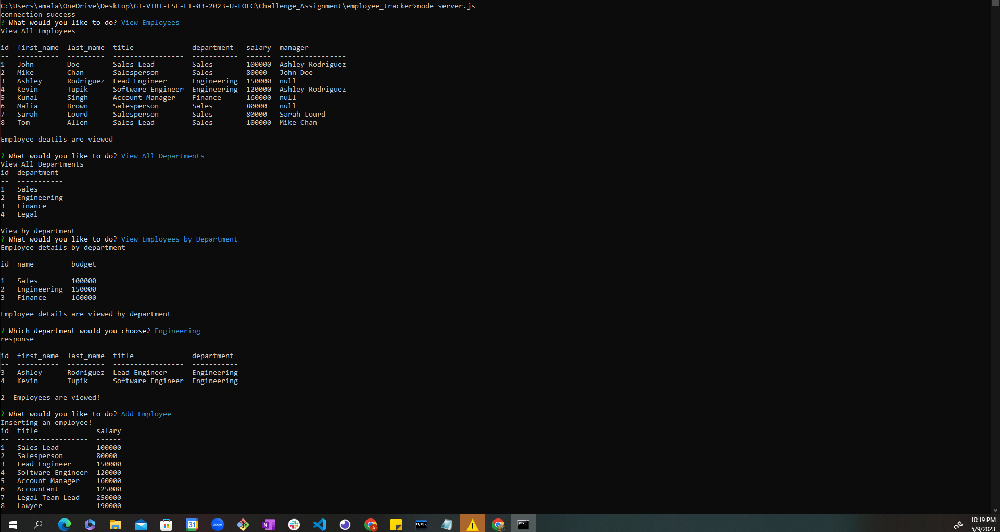
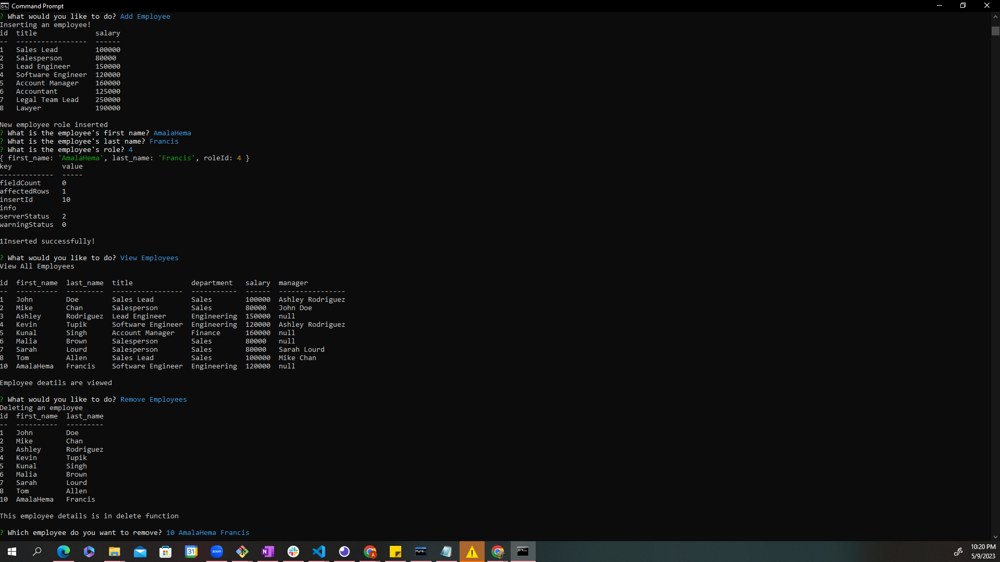
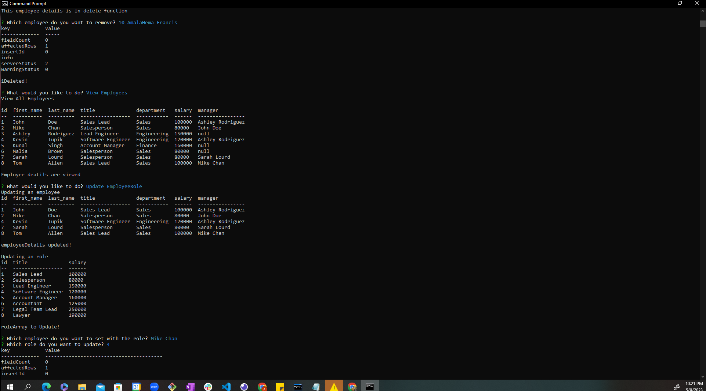

#  Employee Tracker

## Table of contents
- Overview
    - The Challenge
    - Screenshot
    - Links
- My Approach
    - Code construction
    - Learnings
- Author
## Overview

### The Challenge

GIVEN a command-line application that accepts user input
WHEN I start the application
THEN I am presented with the following options: view all departments, view all roles, view all employees, add a department, add a role, add an employee, and update an employee role
WHEN I choose to view all departments
THEN I am presented with a formatted table showing department names and department ids
WHEN I choose to view all roles
THEN I am presented with the job title, role id, the department that role belongs to, and the salary for that role
WHEN I choose to view all employees
THEN I am presented with a formatted table showing employee data, including employee ids, first names, last names, job titles, departments, salaries, and managers that the employees report to
WHEN I choose to add a department
THEN I am prompted to enter the name of the department and that department is added to the database
WHEN I choose to add a role
THEN I am prompted to enter the name, salary, and department for the role and that role is added to the database
WHEN I choose to add an employee
THEN I am prompted to enter the employee’s first name, last name, role, and manager, and that employee is added to the database
WHEN I choose to update an employee role
THEN I am prompted to select an employee to update and their new role and this information is updated in the database 

## Screenshot

The following video shows an example of the application being used from the command line:

[]
[]
[]

### Links
Github URL : https://github.com/amalahema/employee_tracker

## My Approach

### Code Construction
- mysql
- inquirer
- Java script
- nodejs

### Learnings

-  How to create the table and insert the details
-  How to connect the server using MySQL username and password  in the specific port
- Display the list of choices using the inquirer
- Call the individual function depending on the user's choice.
- Assign the result of the MySQL query to the variable query
- Pass the variable as the parameter to the connection 
- Using the response object display the table 
-  How to use left join to get the details of more than one table
- How to set up the primary key 

Walkthrough Video: https://drive.google.com/file/d/1QtQWjT6jf4TmgBhciBSTz56xL-KanbTW/view

